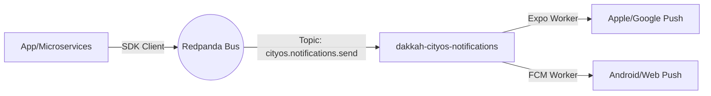

# 📨 Dakkah CityOS Notification System

**The Central Notification Factory for the Dakkah Platform.**

This repository contains the source code for the "Workers" that consume notification events from the platform bus and dispatch them to external providers (Expo/Firebase).

## 🏗️ Architecture at a Glance



## 📦 Workspace Structure

This is a **pnpm workspace** (monorepo).

| Package         | Path                   | Description                                     |
| :-------------- | :--------------------- | :---------------------------------------------- |
| **Expo Worker** | `packages/expo-worker` | Handles React Native (Expo) Push Notifications. |
| **FCM Worker**  | `packages/fcm-worker`  | Handles native FCM (Firebase Cloud Messaging).  |

## 🚀 Quick Start

### 1. Install Dependencies

```bash
pnpm install
```

### 2. Run Locally (Dev Mode)

Requires a running Redpanda instance.

```bash
# Start both workers
pnpm dev
```

### 3. Docker Build

This project builds strictly via the root Dockerfile.

```bash
docker build -t notification-expo-worker --target runner --build-arg PACKAGE_PATH=packages/expo-worker .
```

## 📚 Documentation

Detailed documentation is available in the `docs/` directory:

- [**🏗️ Architecture & Design**](./docs/ARCHITECTURE.md) - How it fits into CityOS.
- [**🔌 Integration Guide**](./docs/INTEGRATION.md) - How to send notifications from your app.
- [**🚢 Deployment & Ops**](./docs/DEPLOYMENT.md) - Environment variables and Docker details.
